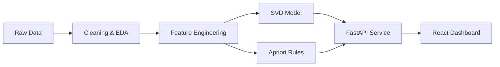

# 🛒 E-Commerce Recommendation System Engine

[](https://www.python.org/)
[](https://fastapi.tiangolo.com/)
[](https://reactjs.org/)
[](https://pandas.pydata.org/)
[](https://opensource.org/licenses/MIT)

## 🌐 Overview

This project is a **professional-grade recommendation engine** and analytics dashboard designed specifically for e-commerce environments. It leverages high-performance algorithms to deliver personalized user experiences and drive business growth through data-driven insights.

Developed as a full-stack solution, it combines a robust **Python/FastAPI** backend with a modern, high-speed **React/Vite** frontend, demonstrating an end-to-end integration of Machine Learning models into a production-ready application.

---

## 🚀 Key Features

### 🧠 Hybrid Recommendation Engine

- **Personalized User Filtering**: Implements **Singular Value Decomposition (SVD)** via Collaborative Filtering to suggest products based on historical user behavior and similarity mapping.
- **Market Basket Analysis (MBA)**: Utilizes the **Apriori Algorithm** to discover frequent itemsets and generate association rules (e.g., "Customers who bought X also bought Y") for cross-selling.

### 📊 Real-Time Analytics Dashboard

- **Executive KPIs**: Track total users, unique products, total transactions, and model health metrics.
- **Visual Analytics**: Interactive charts (Bar, Area, Pie, Scatter) to monitor recommendation distribution and product performance.
- **Product Catalog Management**: Fully paginated catalog with advanced search capabilities.

### 🌍 Localization & Smart Search

- **Bilingual Support (EN/ES)**: Integrated translation engine that handles over 3,500 product descriptions for a global audience.
- **Advanced Autocomplete**: Real-time search for both users and products, optimized for high responsiveness.

---

## 🛠️ Tech Stack & Architecture

### Backend (The Brain)

- **FastAPI**: High-performance asynchronous framework for the REST API.
- **Scikit-Learn & Scikit-Surprise**: Advanced Matrix Factorization for Collaborative Filtering.
- **MLxtend**: Efficient implementation of the Apriori algorithm and association rules.
- **Pandas/NumPy**: Heavy-duty data processing and cleaning pipeline.

### Frontend (The Face)

- **React (18+)**: Component-based UI for a responsive and stateful experience.
- **Vite**: Ultra-fast build tool for the modern web.
- **Recharts**: Data visualization for complex metrics.
- **Lucide Icons & Vanila CSS**: Clean, premium design aesthetic without heavy weight.

### Data Workflow



---

## 📈 Business Value

- **Conversion Optimization**: Personalized recommendations reduce friction and help users find relevant products faster.
- **AOV Growth**: Association rules strategically encourage cross-selling, increasing the Average Order Value.
- **Data-Driven Decisions**: Direct visibility into model performance and sales distribution allows for targeted marketing strategies.

---

## 📥 Installation

### Prerequisites

- Python 3.10+
- Node.js & npm
- Git

### Backend Setup

```bash
# Clone the repository
git clone https://github.com/lucianolabudia/ecommerce-recsys-engine.git
cd ecommerce-recsys-engine

# Initialize Environment
python -m venv .venv
.\.venv\Scripts\Activate.ps1  # Windows

# Install Dependencies
pip install -r requirements.txt
pip install deep-translator
```

### Frontend Setup

```bash
cd dashboard
npm install
```

---

## 🖥️ Running the Application

1. **Start the API**:

   ```bash
   python -m uvicorn app.main:app --reload
   ```

   Interact with the API via Swagger: `http://localhost:8000/docs`

2. **Start the Dashboard**:

   ```bash
   cd dashboard
   npm run dev
   ```

   Browse the UI at: `http://localhost:5173`

3. **Data Localization (Optional)**:
   ```bash
   python scripts/translate_catalog.py
   ```

---

## ✅ System Validation

To ensure all systems are running at peak performance, execute the automated validation suite:

```bash
python scripts/validate_system.py
```

---

## 📬 Contact & Portfolio

**Luciano Labudía**  
[GitHub Profile](https://github.com/lucianolabudia) | [LinkedIn](https://linkedin.com/in/lucianolabudia)

---

_This project was developed with a focus on high availability, clean code principles, and real-world scalability._
